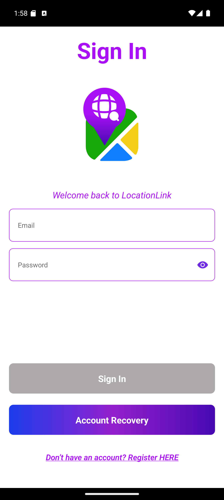
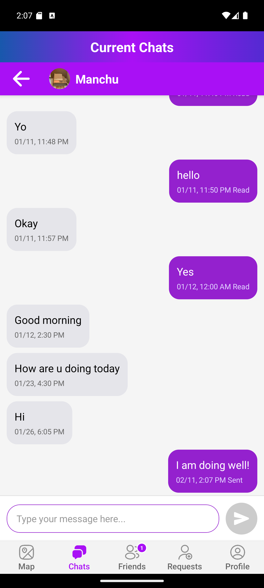
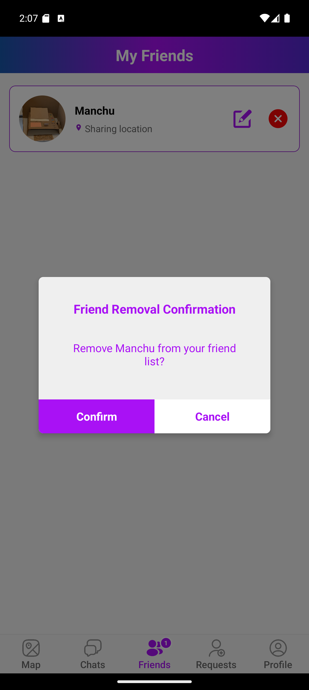
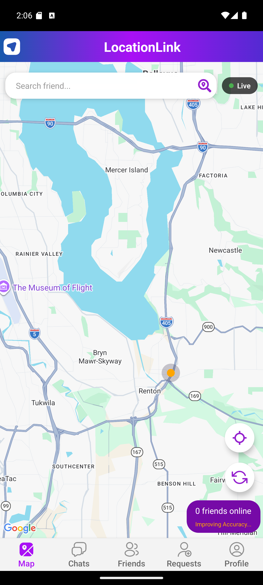
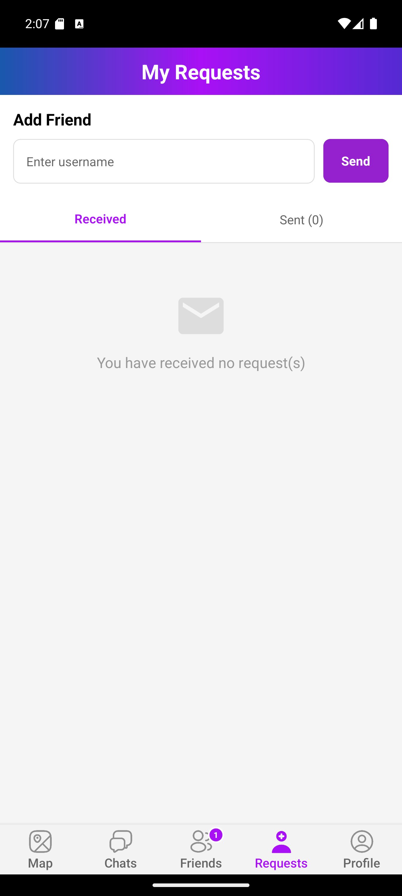
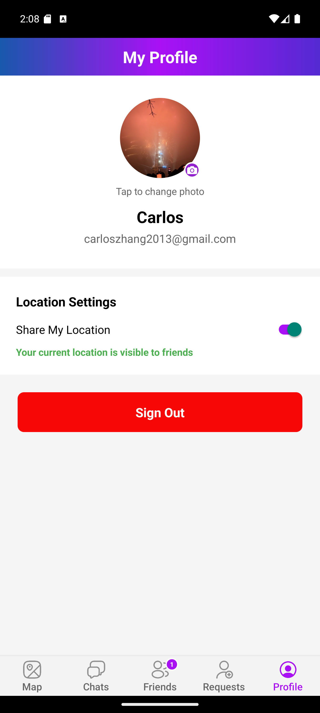

# LocationLink App

## App Description
LocationLink is a comprehensive cross-platform that allow users to freely interact, add other users from 
the globe. Users can choose to share their live locations to their friends and families through this app, 
In addition, the app enables highly customized profiles, direct real-time messaing and chat system between 
multiple users. Currently, it is supported through unconventional IOS and Android Experiemntal Builds

## App Demonstration 
<table align="center">
  <tr>
    <td align="center">
       
      <i>Login</i>
    </td>
    <td align="center">
       
      <i>Chat</i>
    </td>
    <td align="center">
       
      <i>Friend List</i>
    </td>
  </tr>
  <tr>
    <td align="center">
       
      <i>Map</i>
    </td>
    <td align="center">
       
      <i>Requests</i>
    </td>
    <td align="center">
       
      <i>Profile</i>
    </td>
  </tr>
  <tr>
    <td align="center">
       
      <i>Registration</i>
    </td>
  </tr>
</table>
